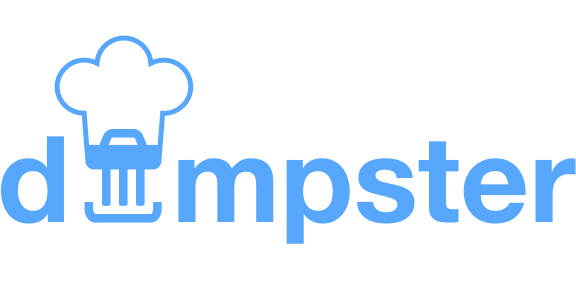

# 
> Networking for social food lovers.

## Synopsis

This is our entry for the [EYA 2017 hackathon](https://eu-youthaward.org/social-hackathon-2017/).
We love food and friends and therefore we need to create the ultimate tool to
combine the best of both worlds. **dumpster chef** is an adventurous journey and
your chance to make new friends and the world a better place by opposing the
[*Throw-away society*](https://en.wikipedia.org/wiki/Throw-away_society).

> A **dumpster diver** is someone who takes items that have been discarded, in
order to make better use of them, principally by turning them into something
usable or edible via dumpster diving. 1 

1: [http://trashwiki.org/en/Dumpster_diver](http://trashwiki.org/en/Dumpster_diver)

## Concept

**dumpster chef** is a smart tool to help you find a dumpster dive place close
to your location and needs. Just ask for *Spaghetti* and the **dumpster bot** will
answer. Always available, as a smartphone app, you are always a click away from
nice food and great people.

**dumpster chef** also uses a great portion of magic to match you with people that
have similar interests and dinner style (the **dumpster [recommender](https://en.wikipedia.org/wiki/Recommender_system)**).
After diving together, you can use recipes and preparation tips for the perfect
dinner w/ your new friends.

The service will also notify you,if a window for diving opens close to your
current location. We also work on a great new [matchmaking](https://en.wikipedia.org/wiki/Matchmaking)
concept. You only deserve the best.

Share your happiness! :v:

## Research

### Primary

* [Trashwiki](http://trashwiki.org/en/Main_Page)

### Secondary

* [Rob Greenfield's Guide to Dumpster Diving](http://robgreenfield.tv/dumpsterdiving/)
* [A Headlong Dive into the Trash](http://www.spiegel.de/international/zeitgeist/dumpster-delicacies-a-headlong-dive-into-the-trash-a-695902.html)

### Related work

* [Facebook Group: Containern und Dumpstern](https://www.facebook.com/containern)
* [Danke! Eine Hamburgerin kämpft dafür, dass du überall gratis Wasser bekommst](http://www.bento.de/nachhaltigkeit/gratis-wasser-mit-refill-hamburg-bekommt-du-ueberall-leitungswasser-1198723/#refsponi)

## Resources

* [App UI Kit](https://www.invisionapp.com/do)

## Team

* :cookie: Neele Barthel
* :chocolate_bar: Susanne Baumgärtner
* :grapes: Tobias Gann
* :princess: Hannes Moser
* :chocolate_bar: Christina Schraml
* :icecream: Vanessa Winklbauer

## Tools

* [Sketch](https://www.sketchapp.com/)
* [Origami](http://origami.design/)
* [Texteditor](https://atom.io/)
* [Git](https://git-scm.com/)
* [Spotify](https://www.spotify.com)
* [Pizza](https://www.pizzamann.at)

## License

[MIT License](https://en.wikipedia.org/wiki/MIT_License)
